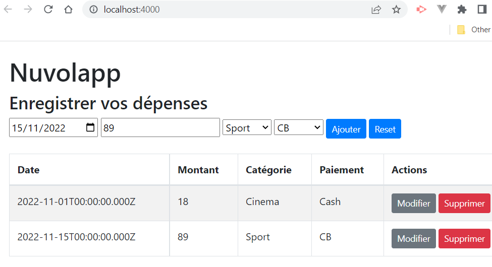

# Nuvolapp

Nuvola est une application "3 tiers":  
- le *front* (Interface utilisateur) constitué par les fichiers du dossier *public/* (index.html et app.js)  
- le *back* lui même divisé en:
    - couche logique (logic layer): le serveur web nodejs/express
    - couche données (data layer): le serveur de base de données mongodb  

Lorsque le client http requiert la route racine (/), le serveur lui renvoie le fichier statique public/index.html, qui lui-même appelle le fichier statique app.js.  
Ces deux fichiers renvoyés au client constitue le *front*, c'est-à-dire l'interface utilisateur (UI).  

L'application front est à l'écoute de certaines actions effectuées par l'utilisateur, comme le click sur bouton par exemple.  
L'application est capable d'interroger, via des requêtes sur certaines routes (endpoints), la couche logique (serveur web) afin de lui faire exécuter des actions "côté back", comme par exemple, accéder à la base de données en lecture/écriture.

## Notes
[Demo de démarrage de l'application dans un env de dev](https://opusidea-training.s3.eu-west-3.amazonaws.com/divers/akka-devops/2022-02-21-projet-final-nuvolapp-test-dev.webm)
